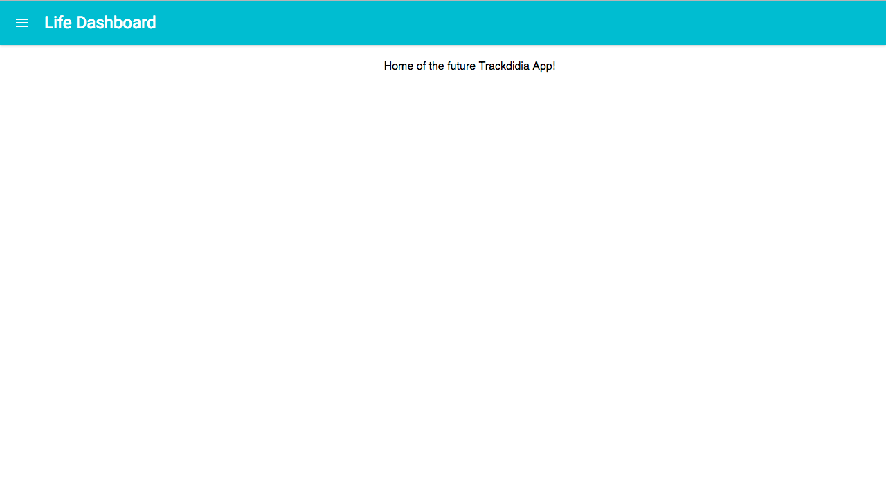

# Trackdidia   
==================

**Description**:  This project is an humble attempt to track almost every thing in my day to day life that can be tracked and then get insights from the data collected. Data driven insights give you an idea about what works well and what should be improved.
I will try to keep it simple and stupid but in the meantime to really get meaningful insight.

**Technology stack**: This project will use Google Cloud Endpoints on the backend side and react + webpack on the Web client.

**Status**: Extremely Alpha, this will continuously changes.

** Link to Production **: Here is the [link](http://trackdidia.appspot.com) to the live instance.
 
**Screenshot**:

## Dependencies

Describe any dependencies that must be installed for this software to work.
This includes programming languages, databases or other storage mechanisms, build tools, frameworks, and so forth.
If specific versions of other software are required, or known not to work, call that out.

## Installation

Detailed instructions on how to install, configure, and get the project running.
This should be frequently tested to ensure reliability. Alternatively, link to
a separate [INSTALL](INSTALL.md) document.

## Configuration

If the software is configurable, describe it in detail, either here or in other documentation to which you link.

## Usage

## How to test the software

## Known issues

## Getting help

If you have questions, concerns, bug reports, etc, please file an issue in this repository's Issue Tracker.

## Getting involved

----

## Open source licensing info
1. [LICENSE](LICENSE)

----

## Credits and references

1. Google AppEngine Dashboard (I just love that new dashboard)
